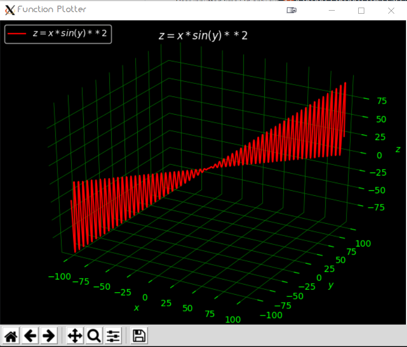
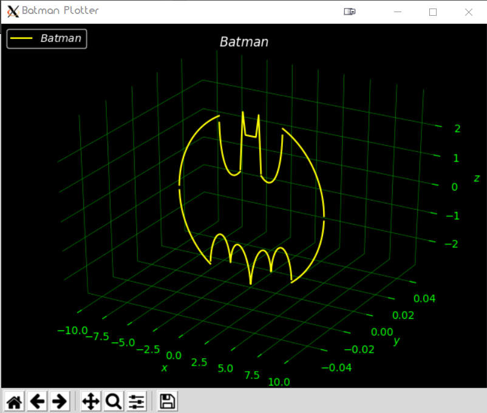
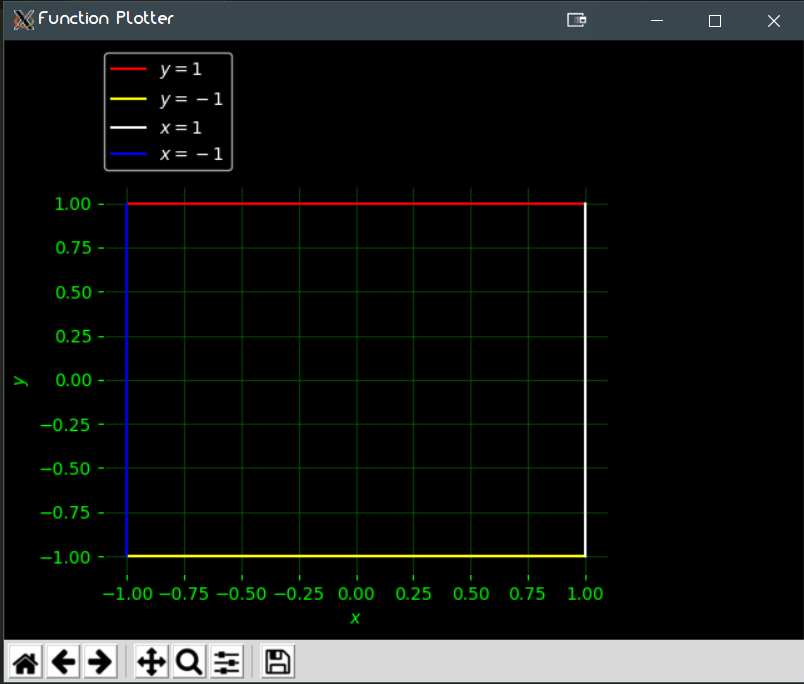
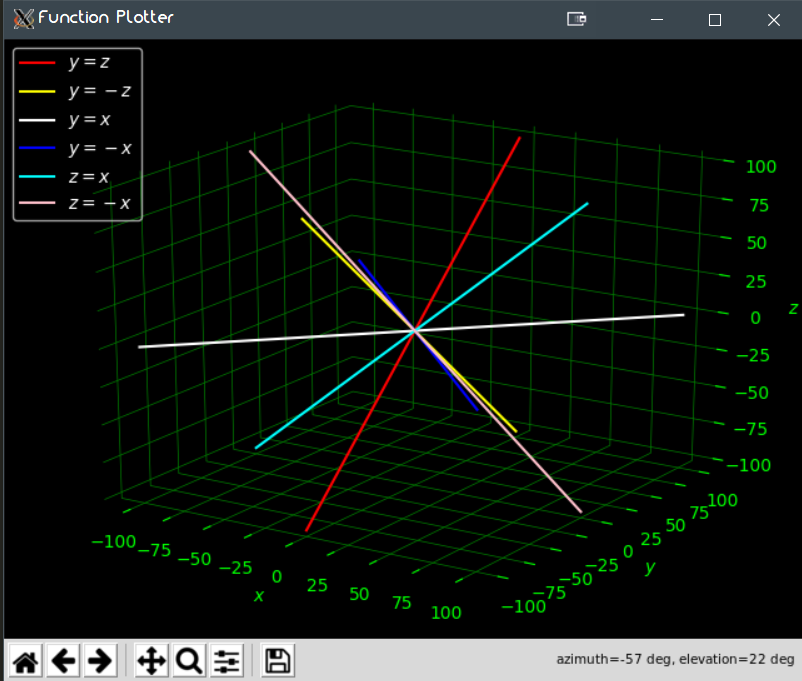
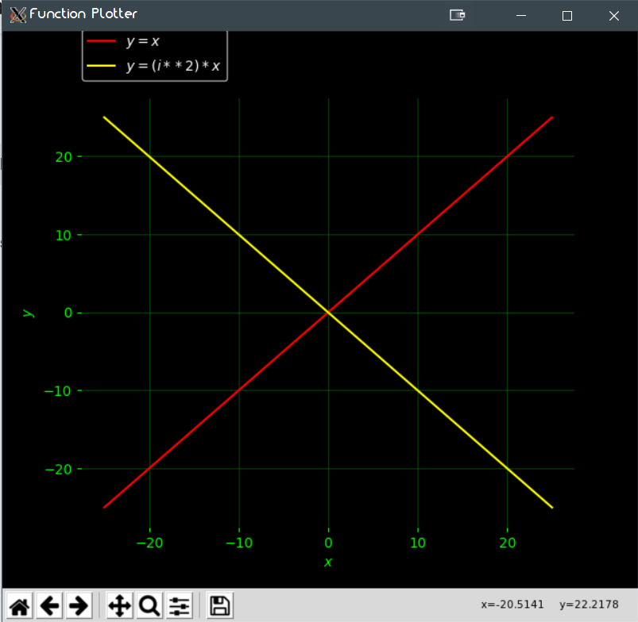

# Function_Plotter
Program for plotting 2D & 3D functions from direct input, written in Python 3 for Linux terminal. 
Uses matplotlib and numpy libraries.

## Instructions:

### How to setup:
In terminal/cmd prompt, clone the repository into you desired location:
```bash
foo@bar:~$ git clone https://github.com/Shellywell123/Function_Plotter.git
```

### How to update:
Navigate to program directory:
```bash
foo@bar:~$ cd Function_Plotter/
```
In terminal/cmd prompt, pull the latest version:
```bash
foo@bar:~$ git pull
```

### How to run:
For 2D functions, in terminal/cmd prompt, execute 'run2d.py' with python 3:
```bash
foo@bar:~$ python3 run2d.py
```
For 3D functions, in terminal/cmd prompt, execute 'run3d.py' with python 3:
```bash
foo@bar:~$ python3 run3d.py
```

## Features
 - Supports 2D and 3D functions
 - Supports many mathematical functions:
    - `sin`, `cos`, `tan`, `arcsin`, `arccos`, `arctan`
    - `sinh`, `cosh`, `tanh`, `arcsinh`, `arccosh`, `arctanh`
    - `log`, `log10_`
    - `abs`
    - `sqrt`
    - `x^n`, `x**n`
    
 - Supports many mathematical constants:
    - `pi`
    - `e`
    - `i`
 - Supports multiple input forms:
    - `y = f(x,z)`, `y = f(x)`, `y = f(z)`
    - `x = f(y,z)`, `x = f(y)`, `x = f(z)`
    - `z = f(x,y)`, `z = f(x)`, `z = f(y)`
 - User inputted funtion limits
    - e.g `y = 4x + 1 #0<x<4`
 - Can input multiple functions at a time
    - e.g `y = 4x + 1, x = -y + 7`
 - Library of functions that can be added to and called with direct aliases: 
    - Library's current contents:
        - Letters: `B`, `C`, `E`, `F`, `H`, `L`, `N`, `T`, `Z`
        - Logos:   `batman`, `heart`
 - Coming Soon
    - Parametric equations
    - Planes and vectors  
    - Polar, Cylindrical, Spherical and Toroidal
    - Complete library of letters and numbers plotted in 2d-3d, allowing words and simple sentences to be graphed.
 

## Fixes to be made
- Some features break after one false input

## Examples
#### 1) Simple Triginometry Example
In terminal/cmd prompt:
```bash
foo@bar:~$ python3 run3d.py
input your function:
>> z = x*sin(y)**2
```
output:



#### 2) Batman Function
In terminal/cmd prompt:
```bash
foo@bar:~$ python3 run3d.py
input your function:
>> batman
```
output:


#### 3) Multiple Functions with set ranges in 2D (Box)
In terminal/cmd prompt:
```bash
foo@bar:~$ python3 run2d.py
input your function:
>> y=1 #-1<x<1, y=-1 #-1<x<1, x=1 #-1<y<1, x=-1 #-1<y<1
```



#### 4) Multiple Functions in 3D
In terminal/cmd prompt:
```bash
foo@bar:~$ python3 run3d.py
input your function:
>> y=z,y=-z,y=x,y=-x,z=x,z=-x
```


#### 4) Complex Example
In terminal/cmd prompt:
```bash
foo@bar:~$ python3 run2d.py
input your function:
>> y=x, y=(i**2)*x
```
output:




